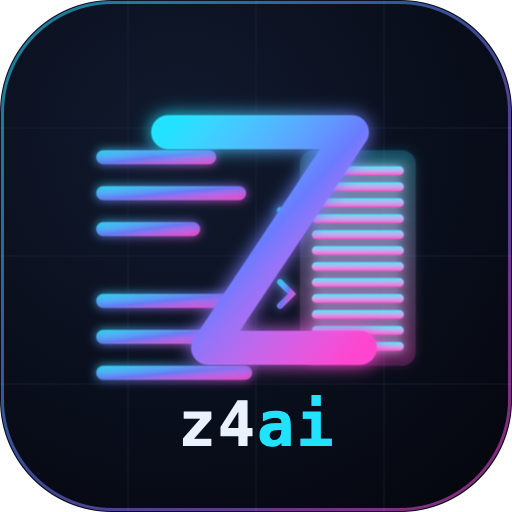
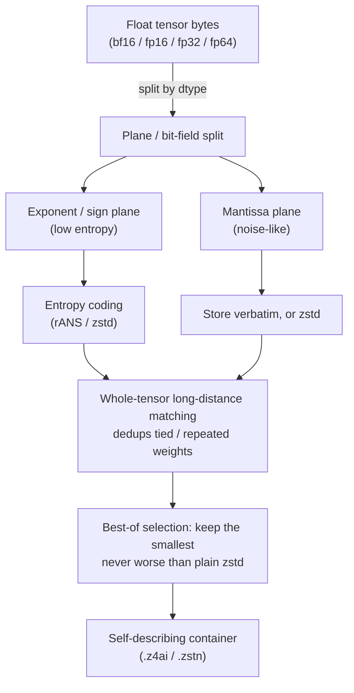

<!-- SPDX-License-Identifier: Apache-2.0 -->

<div align="center">



# z4ai

**A lossless storage-and-distribution layer for AI model checkpoints.**

Keep model checkpoints small for storage and transfer - bit-for-bit reversible,
with per-tensor random access. Most useful on **collections of related
checkpoints** (training runs, fine-tune families, model registries), and in
environments the Hugging Face Hub's Xet backend doesn't cover - self-hosted
registries, internal MLOps, plain object storage.

[](https://github.com/z4ai/z4ai/actions/workflows/ci.yml)
[](https://z4ai.github.io/z4ai/)

**[Documentation](https://z4ai.github.io/z4ai/)** - quickstart, full usage, how it works, and the API reference.

</div>

```bash
pip install z4ai
```

```python
import z4ai

blob = z4ai.compress(weights_bytes)   # smaller, self-describing
data = z4ai.decompress(blob)          # byte-identical original
assert data == weights_bytes
```

Its strongest case is a *sequence* of related checkpoints - consecutive ones are
~95-99% identical, so each is stored as a tiny delta from the one before:

```python
# store checkpoint N as the bit-exact delta from checkpoint N-1
delta    = z4ai.compress_delta(step_2000, reference=step_1000, dtype="bf16")
restored = z4ai.decompress_delta(delta, reference=step_1000)   # exact == step_2000

# only the changed bytes cost anything - often 10-100x smaller than a full compress
```

Or from the command line, on files:

```bash
z4ai compress   weights.bin -o weights.z4ai --dtype fp32
z4ai decompress weights.z4ai -o weights.bin
z4ai info       weights.z4ai            # ratio + per-plane breakdown
```

Requires Python >= 3.9; pure Python (NumPy + `zstandard`), with optional native
acceleration.

## TL;DR

z4ai is a codec built for the byte structure of float tensors. Compared with
[ZipNN](https://github.com/zipnn/zipnn) (the closest weights-specific codec):

- **Ties** on dense weights, with a slight edge on real models (distilgpt2
  +1.6-8.2%, pythia-70m +11-29%) from an order-1 context exponent coder.
- **Wins big** on *repeated structure* - tied embeddings, duplicated layers,
  multi-shard concatenations - which z4ai dedups across the **whole tensor**.
- **2.3-3.0x** on **reduced-precision** fp32 files (fp16/bf16-origin values), automatically.
- **2.4-10.8x** on **quantized** weights shipped in a wide container - INT4/INT8/FP8
  (GPTQ / AWQ / `compressed-tensors`) dequantised into bf16/fp16/fp32 - via an
  automatic lossless [palette](z4ai/palette.py) transform. This is the common
  *deployed* format, and z4ai beats ZipNN on every case here (e.g. INT8-in-fp32
  **4.72x vs 1.94x**; INT4-in-fp32 **10.8x vs 4.6x**).
- **Big wins on sparse / pruned** weights, and **10-180x on checkpoint sequences**
  via the lossless `compress_delta` mode - which ZipNN has no equivalent for.
- **Slower to compress** than ZipNN's compiled-C core; decompress is competitive.

> **Honest ceiling.** On a *dense* checkpoint a trained float's mantissa is
> near-random and its exponent carries only ~2.6 bits, capping *any* lossless
> codec at ~1.5x (bf16) / ~1.2x (fp32). ZipNN already hits that wall, so z4ai
> can't meaningfully out-*ratio* it there - it wins by a hair via order-1 rANS on
> the exponent. The large wins come from redundancy the entropy bound assumes
> away: reduced precision, sparsity, structure, and cross-checkpoint deltas.

All numbers below are **measured on this repo** and reproducible with one command.

## Benchmarks vs ZipNN

<sub>Machine: 16 cores | Python 3.14 | `zstandard` 0.25.0 | `zipnn` (latest) |
32 MB per dtype | best-of-3 timing. Every codec is verified byte-exact (lossless).</sub>

### Compression ratio (higher is better)

<table>
<thead>
<tr><th align="left">Scenario</th><th>dtype</th><th>z4ai</th><th>ZipNN</th><th>zstd&#8209;3</th><th>z4ai vs ZipNN</th></tr>
</thead>
<tbody>
<tr><td align="left">Dense / i.i.d. weights</td><td align="center">bf16</td><td align="center">1.413</td><td align="center"><b>1.417</b></td><td align="center">1.227</td><td align="center">-0.3% | tie</td></tr>
<tr><td align="left">Dense / i.i.d. weights</td><td align="center">fp32</td><td align="center">1.171</td><td align="center"><b>1.172</b></td><td align="center">1.061</td><td align="center">-0.1% | tie</td></tr>
<tr><td align="left">Structured (repeated/duplicated)</td><td align="center">bf16</td><td align="center"><b>58.1</b></td><td align="center">1.51</td><td align="center">16.97</td><td align="center"><b>+3750%</b></td></tr>
<tr><td align="left">Structured (repeated/duplicated)</td><td align="center">fp32</td><td align="center"><b>47.3</b></td><td align="center">1.20</td><td align="center">14.24</td><td align="center"><b>+3831%</b></td></tr>
<tr><td align="left">Sparse (50% zeros)</td><td align="center">bf16</td><td align="center"><b>2.47</b></td><td align="center">2.20</td><td align="center">1.88</td><td align="center">+12.5%</td></tr>
<tr><td align="left">Sparse (50% zeros)</td><td align="center">fp32</td><td align="center"><b>2.21</b></td><td align="center">1.86</td><td align="center">1.79</td><td align="center">+18.9%</td></tr>
<tr><td align="left">Quantized INT8 (dequantised to&hellip;)</td><td align="center">bf16</td><td align="center"><b>2.39</b></td><td align="center">2.07</td><td align="center">1.79</td><td align="center">+15.6%</td></tr>
<tr><td align="left">Quantized INT8 (dequantised to&hellip;)</td><td align="center">fp32</td><td align="center"><b>4.72</b></td><td align="center">1.94</td><td align="center">3.07</td><td align="center"><b>+143%</b></td></tr>
<tr><td align="left">Quantized INT4 (dequantised to&hellip;)</td><td align="center">bf16</td><td align="center"><b>5.41</b></td><td align="center">3.87</td><td align="center">3.91</td><td align="center">+39.9%</td></tr>
<tr><td align="left">Quantized INT4 (dequantised to&hellip;)</td><td align="center">fp32</td><td align="center"><b>10.77</b></td><td align="center">4.59</td><td align="center">5.13</td><td align="center"><b>+135%</b></td></tr>
</tbody>
</table>

<sub>Quantized rows: per-tensor INT4/INT8 weights dequantised back into a wide
float container (the format most quantized models ship in), same 32&nbsp;MB/dtype
config as above. z4ai auto-selects the lossless palette transform; several ZipNN
entries here are <i>not</i> byte-exact on the tested build. Reproduce with
<code>python benchmarks/bench_palette.py</code> (which reports a stronger
<code>zstd-19</code> baseline, so z4ai's margin there is conservative).</sub>

### Real & production workloads

<table>
<thead>
<tr><th align="left">Workload</th><th>z4ai</th><th>ZipNN</th><th>Note</th></tr>
</thead>
<tbody>
<tr>
<td align="left"><b>Real checkpoint</b> - bert-tiny, 17.7&nbsp;MB fp32 (downloaded)</td>
<td align="center">1.188</td><td align="center"><b>1.202</b></td>
<td align="left">-1.2% - a single dense checkpoint ~ i.i.d., so a small loss. The win is on redundancy, not dense noise.</td>
</tr>
<tr>
<td align="left"><b>Production .safetensors</b> - 201&nbsp;MB BF16 with a tied embedding</td>
<td align="center"><b>1.525</b></td><td align="center">1.510</td>
<td align="left">+1.0% vs per-tensor ZipNN - z4ai dedups the tied <code>embed_tokens</code>/<code>lm_head</code> that ZipNN's 256&nbsp;KiB chunking can't.</td>
</tr>
<tr>
<td align="left"><b>Realistic full checkpoint</b> - 107&nbsp;MB BF16 (tied embeddings, shared blocks, optimizer state, 50% pruned layer)</td>
<td align="center"><b>2.93</b></td><td align="center">1.67</td>
<td align="left"><b>+75.7%</b> - z4ai's whole-buffer LZ dedups the structure real checkpoints carry; ZipNN's chunked Huffman cannot see across chunks.</td>
</tr>
<tr>
<td align="left"><b>Checkpoint delta</b> - bert-tiny BF16, 5% of weights changed</td>
<td align="center"><b>51.1</b></td><td align="center">~1.7</td>
<td align="left"><b>30x smaller</b> than from-scratch. <code>compress_delta</code> stores only what changed (1% &rarr; 184x; 20% &rarr; 18x). ZipNN has no delta mode.</td>
</tr>
</tbody>
</table>

<details>
<summary><b>Reproduce</b></summary>

```bash
python benchmarks/benchmark.py --mb 32 --dtypes bf16 fp32 --scenario iid
python benchmarks/benchmark.py --mb 32 --dtypes bf16 fp32 --scenario structured
python benchmarks/benchmark.py --mb 32 --dtypes bf16 fp32 --scenario sparse
python benchmarks/bench_real_checkpoint.py        # downloads a real .bin checkpoint
python benchmarks/bench_safetensors.py --layers 8 --d 1024
python benchmarks/checkpoint_bench.py --mb 96     # realistic structured checkpoint
```

</details>

### Throughput

<table>
<thead>
<tr><th align="left">Codec</th><th>compress</th><th>decompress</th></tr>
</thead>
<tbody>
<tr><td align="left">z4ai (i.i.d. bf16, MB/s)</td><td align="center">1420</td><td align="center">16700</td></tr>
<tr><td align="left">ZipNN</td><td align="center"><b>8125</b></td><td align="center"><b>20020</b></td></tr>
</tbody>
</table>

z4ai compresses ~6x slower and decompresses ~1.2x slower than ZipNN's compiled-C
core - the deliberate trade for a **write-once, read-many** artifact. A fused
multithreaded native codec (`z4ai.chunked`) and `effort="fast"`/`"max"` tiers
trade decode latency against file size.

## How it works

A float is `[ sign | exponent | mantissa ]`: in trained weights the exponent bits
repeat heavily while the mantissa looks like noise, and the two are interleaved
byte-by-byte - so a general-purpose zip can't separate them (plain `zstd` on raw
fp32 barely reaches ~1.06x). z4ai pulls the bytes apart, matches redundancy across
the whole tensor, then entropy-codes each part near its floor:



Decoding is the exact inverse, driven entirely by the self-describing header - no
side-channel metadata, and the output is never larger than the input. Pruned
weights take a zero-aware path; the safetensors/ZSTN container adds a per-tensor
index for random-access reads and stores tied weights once.

## References

z4ai's building blocks are well-studied; the contribution is applying them to the
byte structure of model weights and matching across the whole tensor - and across
checkpoints. On *dense* weights it cannot meaningfully out-ratio ZipNN (the entropy
ceiling binds every lossless codec equally); the wins come from structure, reduced
precision, sparsity, and cross-checkpoint deltas.

- **Float field decorrelation** - Lindstrom & Isenburg, *fpzip*, IEEE TVCG 2006
  ([project](https://computing.llnl.gov/projects/fpzip)); applied to NN weights by
  [ZipNN](https://arxiv.org/abs/2411.05239) (the codec benchmarked against here).
- **Long-distance LZ matching** - Ziv & Lempel,
  [LZ77](https://ieeexplore.ieee.org/document/1055714) (1977), via Zstandard
  ([RFC 8878](https://datatracker.ietf.org/doc/html/rfc8878)).
- **Entropy coding (rANS)** - Duda,
  [Asymmetric Numeral Systems](https://arxiv.org/abs/1311.2540) (2013).
- **Cross-checkpoint / cross-model delta** - [ZipLLM](https://arxiv.org/abs/2505.06252)
  (NSDI 2026) - the basis for `compress_delta` / `model_delta`.

The full survey (DFloat11, NeuZip, DietGPU, ECF8, ALP, Pcodec, the BF16 entropy
ceiling) is in the [docs](https://z4ai.github.io/z4ai/background.html).
